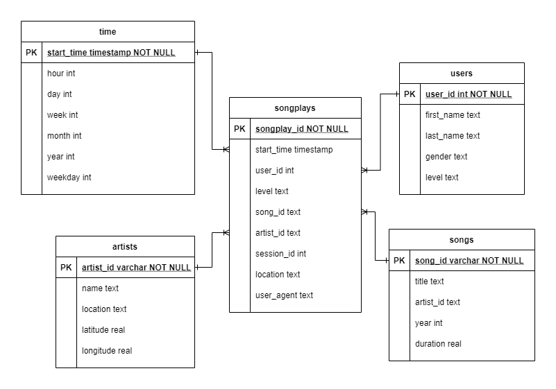

# Sparkify Data Modeling
This project addresses data warehousing for Sparkify which want to move their user activity logs JSON in S3 to Amazon Redshift. 

## Files

- `create_tables.py` is a python script to run drop and create SQL script
- `sql_queries.py` contains SQL scripts to build the database schema, copy, and insert to Redshift
- `etl.py` is the ETL python script to run the SQL scripts defined in `sql_queries.py`
- `README.md` contains the documentation about the project
- `dwh.cfg.example`, which should be set and renamed to `dwh.cfg`, contains the configurations to connect to AWS resources  
- `test.ipynb` contains the SQL scripts to test the ETL

## How to Run
First, make sure to have AWS Redshift cluster with permission to access S3 created and have its configuration information written in `dwh.cfg`.

Then, run

```
python create_tables.py
```
to recreate database schema to Redshift clusters.

Then run

```
python etl.py
```
to start ETL process which will run SQL commands for Redshift to start copy S3 JSON files to Staging table, and then create the final Analytic table
which will be used by Sparkify's Data Analytics.

## Database Schema
Overall, this project still follows database schema that was defined in Sparkify Data Modelling project with some customization for Redshift implementation.



The database schema consists of `songplays` table as the fact table with refers to `users`, `songs`, `artists`, and `time` table as the dimension tables.


## Data Source
Song data: s3://udacity-dend/song_data
Log data: s3://udacity-dend/log_data
Log data json path: s3://udacity-dend/log_json_path.json

## Results and Notes
All fact tables are filled accordingly although we see some duplications for entries, such as multiple artists name with different id or location. 

Some of the results can be checked in `test.ipynb`.  
